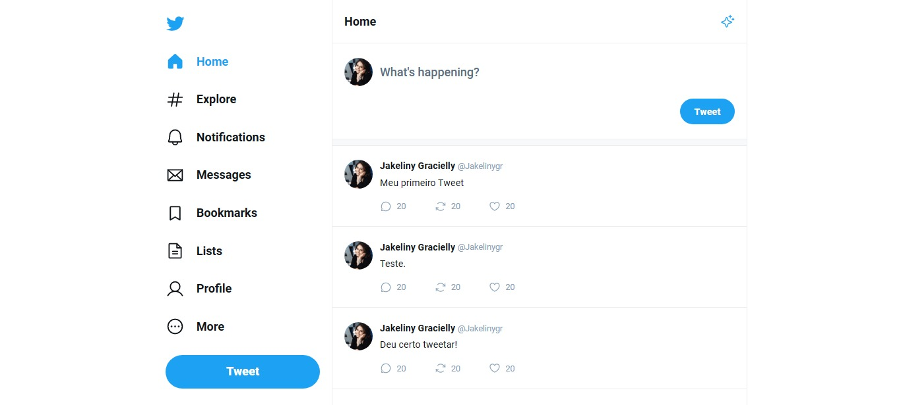
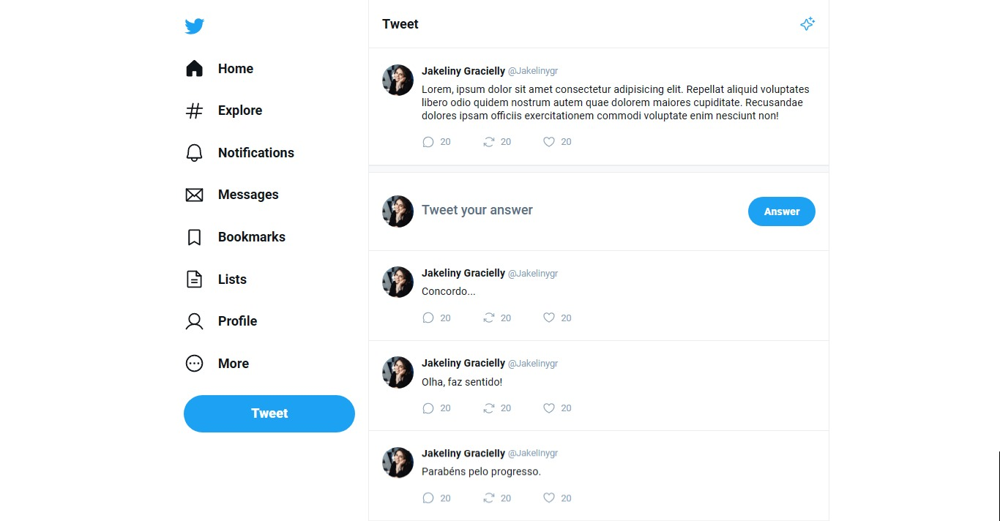
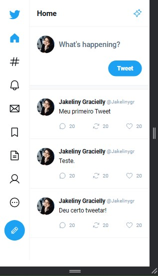
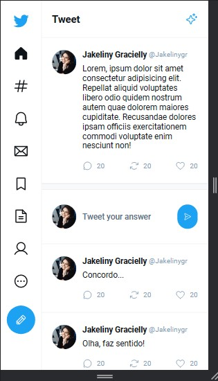

<h1 align="center"> Twitter UI - Clone </h1>

Construindo uma de um clone da interface de usuário (UI) do Twitter utilizando React focado em abordar os fundamentos dessa tecnologia como componentização, propriedades, estado, formulários, etc..  

  

 

<h2>Modo Padrão</h2>

  

  

 

<h2>Modo Responsivo</h2>

  
  

 

## 🚀 Tecnologias

Esse projeto foi desenvolvido com as seguintes tecnologias:

- TypeScript
- NodeJS
- ReactJS
- HTML
- CSS (Styled Components)
- Vite
- HookForm (Zod)
- HookForm (resolvers)
- date-fns (Biblioteca Javascript de datas e horas)
- phosphor (React)
- router (Dom_React)
- Figma

 

## Como utilizar?

1. Baixe esse repositório e com o seu o terminal, entre no diretório;

2. Rode o comando `npm install` para instalar as dependências;

3. E pra iniciar a aplicação, rode o comando `npm run dev`.

Após executar o comando acima, abra o seu navegador e acesse o endereço:

`http://localhost:5173/`

 

## 🔖 Layout

Você pode visualizar o layout do projeto através [DESSE LINK](https://www.figma.com/community/file/1202694130789327431). É necessário ter conta no [Figma](https://figma.com) para acessá-lo.

 

## Preview do projeto

Você pode conferir o projeto funcionando aqui:

> https://masterclass-react.vercel.app/

 

## 📝 License

Esse projeto está sob a licença MIT.

---

Feito por Ciro Batista da Silva
